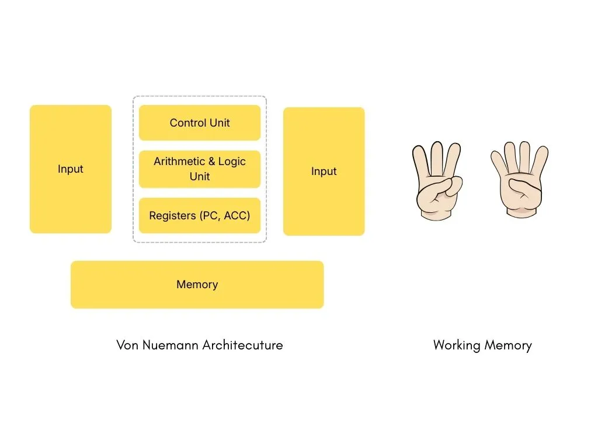

#### Contents

1. [Introduction](#introduction)
1. [Setup](#setup)

## Introduction

Von_Neumann_Architecture.webp

## Setup

- Download & Install latest version from here [Python Release](https://www.python.org/downloads/windows/)
- Add installation dir to PATH environment variable.
- Download & Install VS Code from here [VS Code](https://code.visualstudio.com/download)
- Install Python extension from Marketplace [Python Extension](https://marketplace.visualstudio.com/items?itemName=ms-python.python)
- Open Command Prompt / Terminal and type 'python' to verify installation.

## Variables